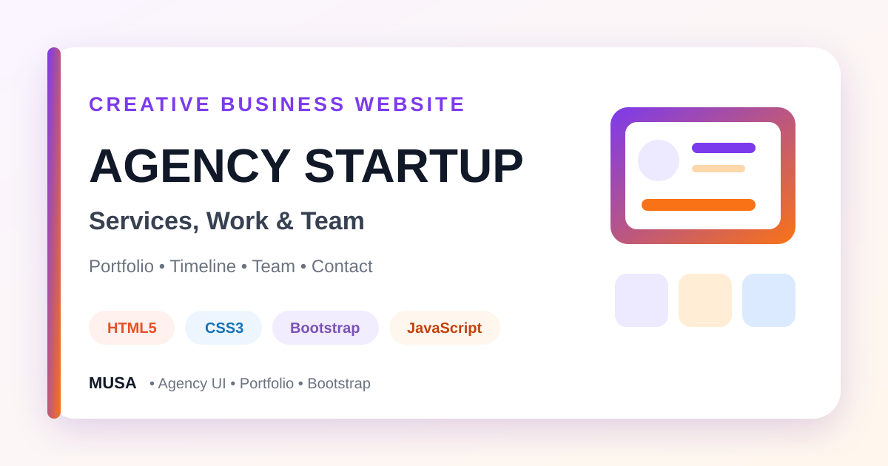

<div align="center">



# Creative Agency Startup Website

### A responsive one-page agency website with services, portfolio modals, company timeline, team profiles, and a contact interface.


[](https://github.com/samusa099)
[](https://developer.mozilla.org/docs/Web/HTML)
[](https://developer.mozilla.org/docs/Web/CSS)
[](https://getbootstrap.com/)
[](https://developer.mozilla.org/docs/Web/JavaScript)

[](https://github.com/samusa099/Agency-Statup)
[](https://github.com/samusa099/Agency-Statup)
[](https://github.com/samusa099/Agency-Statup/commits/main)

</div>

---

## 📌 Overview

A responsive creative-agency interface featuring services, portfolio modals, company history, team members, client branding, calls to action, and contact content.

## 📚 Documentation

| Resource | Description |
|---|---|
| [**HOW_TO_USE.md**](HOW_TO_USE.md) | Detailed customisation, file-map, reuse, accessibility, and deployment guidance |
| [**Repository Cover**](assets/repository-cover.svg) | Scalable professional cover used in this README |

## ✨ Key Features

- Fixed responsive navigation and masthead
- Service cards for digital offerings
- Portfolio grid with modal details
- Agency-history timeline
- Team and client-logo sections
- Contact interface and responsive footer

## 🗂️ Repository Structure

```text
Agency-Statup/
├── index.html
├── css/
├── js/
├── img/
├── assets/
│   └── repository-cover.svg
├── HOW_TO_USE.md
└── README.md
```

## 🚀 Run Locally

```bash
git clone https://github.com/samusa099/Agency-Statup.git
cd Agency-Statup
```

Open `index.html` in a browser or use **VS Code Live Server**.

> Portfolio, timeline, team, client, and contact content should be replaced before public business use.

## 👤 Author

<div align="center">

### Musa

**Internationally certified HR professional and data analytics practitioner from Bangladesh.**  
Musa combines people operations, Excel, Power BI, SQL, and technology-driven problem-solving to build practical, structured, and user-focused projects.

[](https://github.com/samusa099)

</div>
